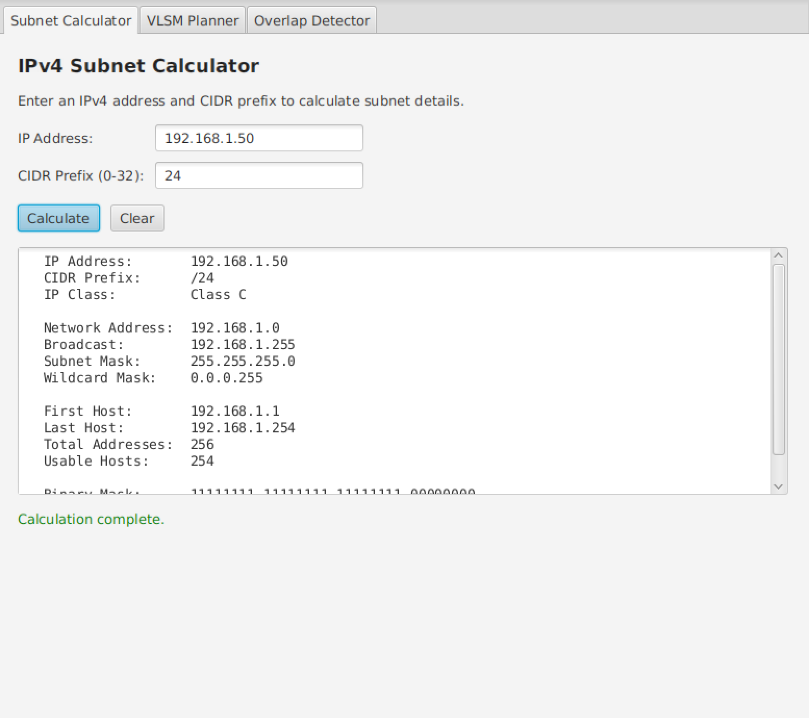
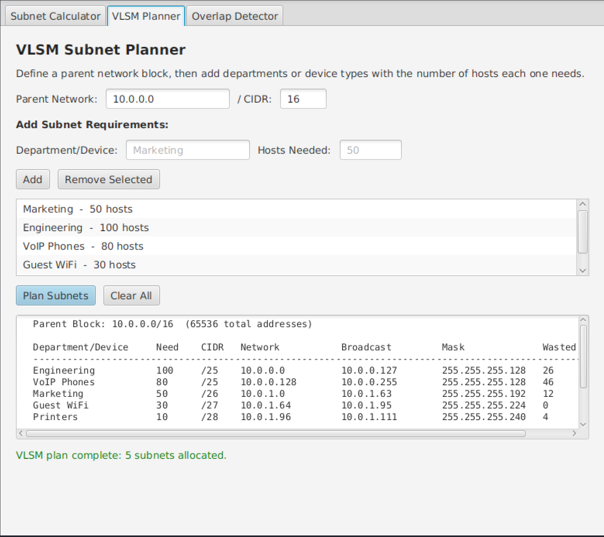
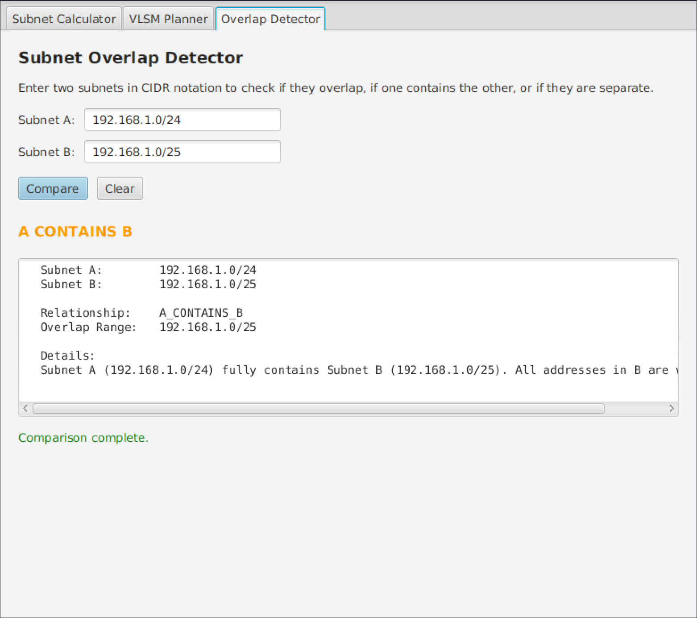

# IPv4 Subnet Calculator

A desktop subnet calculator built with Java and JavaFX. It handles basic subnet calculations, VLSM planning with department and device labels, and overlap detection between two CIDR ranges.

## Why I Built This

I wanted a project that combined the networking concepts from my coursework with Java GUI development. Subnetting comes up a lot in networking and security classes, and I found myself relying on online calculators without fully understanding the math behind them. Building one myself was a good way to change that.

Most subnet calculators I found only do basic IP and mask lookups. I wanted mine to also handle VLSM planning where you can define departments and device types with host counts. In a real environment you would need subnets for different teams, VoIP phones, printers, guest wifi, and so on. The VLSM tab lets you plan those allocations from a single parent block and see how much address space each one uses.

## Features

The application has three tabs:

**Subnet Calculator** takes an IP address and CIDR prefix and returns the network address, broadcast address, subnet mask, wildcard mask, usable host range, total host count, IP class, and the binary representation of the mask.

**VLSM Planner** takes a parent network block and lets you add rows for each department or device type with the number of hosts they need. It sorts by largest requirement first, allocates the smallest subnet that fits each one, and shows a table with the full allocation map including wasted addresses.

**Overlap Detector** takes two CIDR ranges and reports whether they are disjoint, overlapping, identical, or if one contains the other. This is useful when you are adding a new subnet and need to make sure it does not conflict with existing allocations.

## Screenshots

### Subnet calculator tab


### VLSM planner tab


### Overlap detector tab


## Project Structure

All source files are in `src/com/subnetcalc/` and organized into three packages:

- `model/` contains the data classes (SubnetResult, VLSMAllocation, OverlapResult) that hold calculation outputs. These have no JavaFX dependencies.
- `logic/` contains the calculation logic (SubnetCalculator, VLSMPlanner, OverlapDetector). These also have no JavaFX dependencies, so the same code could work with a different frontend later.
- `gui/` contains the JavaFX interface (MainApp, CalculatorTab, VLSMTab, OverlapTab).

I separated them on purpose so the math and the interface do not depend on each other.

## Prerequisites

- Java 21 or newer
- JavaFX (openjfx package on Linux)

### Install on Kali/Debian/Ubuntu
```bash
sudo apt-get install openjdk-21-jdk openjfx
```

## Build and Run

```bash
chmod +x build.sh run.sh
./build.sh
./run.sh
```

If JavaFX is installed through apt, the scripts detect it automatically. If you downloaded the JavaFX SDK manually, set the `JAVAFX_HOME` environment variable to the SDK directory before building.

## How the Math Works

IP addresses are converted to integers and the subnet mask is created by shifting bits based on the CIDR prefix. The network address comes from AND-ing the IP with the mask, and the broadcast is the network address OR'd with the inverted mask. The rest of the output is built from those values.

The VLSM planner sorts requirements largest first, then walks through the parent block fitting each one into the smallest subnet that works. The overlap detector converts both ranges to start and end addresses and checks whether they intersect.
